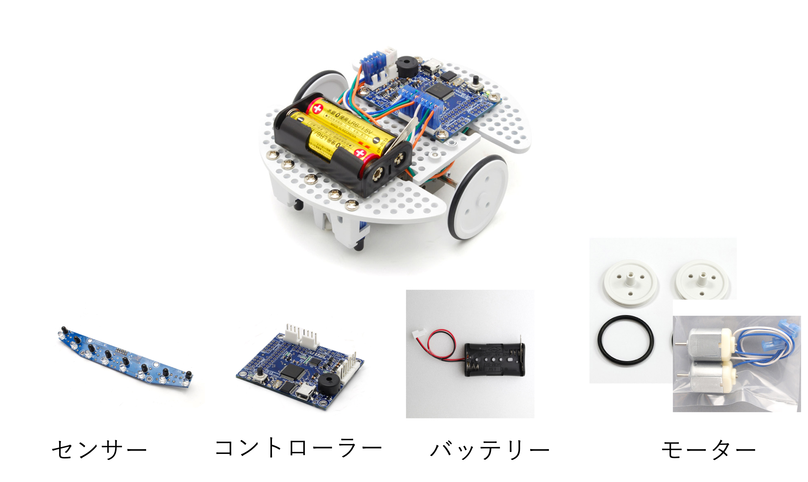

## 第2回 配列と制御構文

# 目次

* Topics
{:toc}

# 先週の復習

先週は再帰関数など少し難しい内容が多く説明が足りなかった部分もあるかもしれません。

本当の詳しいところは、今後授業や競プロなどで興味があれば是非沼にハマっていってください。

この講習の目的としては、制御構文や関数を扱えるという部分なので前回の後半の内容をすべて理解していなくても大丈夫です。

## 複雑な制御構文

### Case文

```ruby
def getClass(age)
  if 0..2
    "幼児"
  when 3..6
    "小児"
  when 7..12
    "子供"
  when 13..18
    "若者"
  else
    "大人"
  end
end
```

`case A`としたとき`A`とwhenで指定された部分が一致する処理を行いってくれます。`else`はどの条件にも当てはまらないときに呼ばれる。

1つの値に対して複数の条件分岐をする場合に完結に書くことができる。

### While文

while文は条件を満たす間は処理を行う処理。

```ruby
def countdown(n)
  while n > 0 do
    puts n
    n = n -1
  end
end
```

のような処理をすると、`n > 0`を満たす間は`n = n - 1`をするので、nから順にカウントダウンされていきます。

#### each文

```ruby
data = [1, 2, 3]
sumA = 0.0
sumB = 0.0
for num in data do
  sumA += num
end
data.each do |num|
  sumB += num
end
```

のように配列から順番に要素を取り出して処理をすることが可能です。

#### breakとnext

`break`はループを強制的に抜ける命令で

```ruby
10.times do |i|
  break if i > 5
  puts i
end
```

このように、`i`が5より大きくなると`break`が呼び出されて`for`文から強制的に抜けるので、

```
0
1
2
3
4
5
```
となります。

また、`next`文を使うと特定の条件で処理をスキップすることもでき、

```ruby
10.times do |i|
  next if i % 2 == 0
  puts i
end
```

のようにすると、`i`が2の倍数のときに`next`が呼び出されて処理がスキップされます。
つまりは、

```
1
3
5
7
9
```

のように奇数だけが出力されるようになります。

## 修飾子

`if`や`while`などの文は

```ruby
def fac(n)
  return 1 if n == 0
  return n * fac(n-1)
end
```

のように、`処理 if 条件`などのようにすると1行で書くことが可能。

## 再帰関数

```ruby
def fac(n)
  return 1 if n == 0
  return n * fac(n-1)
end
```

のようなコードが有る場合に、例えば、`n=3`を入れた時の動作を見てみると

```
fac(3) => 3 * fac(2)
fac(2) => 2 * fac(1)
fac(1) => 1
```

順番に代入してみると、

```
fac(3) => 3 * 2 * 1 = 6
```

となります。

このように関数の中で関数を呼び出すことが可能。

- 再帰関数を使うと漸化式などをそもまま実装できる

- 繰り返しで書くよりも完結に書ける場合もある

ただし、関数を呼び出す回数が多くなりすぎるとエラーが起きるので注意。

再帰関数を使いこなせると色々なアルゴリズムを実装できるが、少し複雑になるのでこの講習では省略。

キーワード
- 動的計画法(メモ化再帰)
- 幅優先探索
- 関数型プログラミング

沼にハマりたい人は是非

# スコープ

今回の講習では基本的に関数ベースで話しをしていたため、あまり登場していなかったが補足。

Rubyで今まで扱ってきた変数にはいくつか種類があった。

- **ローカル変数** (今までこれを使ってた)
- インスタンス変数
- クラス変数
- グローバル変数

```ruby
name = "Void"

def greet(name)
  script =  "Hello!" + name + "!"
  puts(script)
end

greet("Void")
puts(script)
```

これを実行すると、
```
Hello!Void!
Error: eval:9:in `<main>': undefined local variable or method `script' for main:Object (NameError)
```
のようにエラーが発生する。

関数の中で定義された変数は関数のみで有効。

スコープは、**変数の有効範囲**のこと。

## グローバル変数

では、関数の中で定義した変数を外でも使いたい場合は？

```ruby
name = "Void"

def greet(name)
  $script =  "Hello!" + name + "!"
  puts($script)
end

greet("Void")
puts($script)
```

これだと、
```
Hello!Void!
Hello!Void!
```
のように正しく表示される。

変数の先頭に、`$`をつけて`$script`あげると**グローバル変数**と呼ばれるものになる。

**グローバル変数**のスコープ(有効範囲)はプログラム全体なので、どこからでも参照できる。

# オブジェクト指向

プログラミング言語にはいくつか種類がある。

- 手続き型言語(C言語やBASICなど)
- オブジェクト指向言語(**Ruby**やPythonなど)
- 関数型言語(GoやHaskellなど)

この中でも、**Ruby**はオブジェクト指向という考え方に基づいた言語になっている。

オブジェクト指向の重要な3つの概念は、

- カプセル化(隠蔽)
- 継承
- ポリモーフィズム

今回は雰囲気だけ。

プログラムでは、クラスと呼ばれる関数やデータをまとめたものを扱います。

例えば、ラインをトレースするロボットを制御することを考えてみます。



このロボットをパーツごとに分解してみると、大きく分けると

- コントローラー
- センサー
- バッテリー
- モーター

に分けられます。

- カプセル化

普通にモーターを制御する場合には、

モータードライバの仕様を理解した上で、それを駆動させるための信号を作成するプログラムを作らなくてはいけませんが、制御する側はそんなハードウェアのことなんて気にしたくないですよね。

つまりは、モーターをどっちに回すのかと速度を指定すれば勝手にモーターが回ってくれれば良いですよね。

あと、モータードライバを変更するたびに変更するの面倒ですよね。一回、作ったら他のロボットでも使いまわしたい。

このように、内部の処理を`ブラックボックス化`してあげることをカプセル化といいいます。

- 継承

では、車を動かすためにモーターを制御するクラスを作りました。

車の「直進」「止まる」「曲がる」といったいったようなものを実装するときに、それぞれでまたモーターを制御する設定を書くのは面倒ですよね。

そこで、基本的な設計図を用意して他の必要な部分はそれぞれカスタマイズします。これが継承です。

では、実際にRubyでどのように実装されるのか見てみます。

```ruby
class ClassName
def method_name(arg1,arg2,...)
  処理
end

instance = ClassName.new()
instanace.medhot_name()
```

RubyではこのようにClassを定義します。

クラスを実行する際には、インスタンスと呼ばれる実体を生成します。

```ruby
class Motor
  def stop()
    puts "Stop"
  end
  def move(speed)
    puts "MOVE #{speed}"
  end
end

rightMotor = Motor.new
rightMotor.move(1.0)
rightMotor.stop()
```

実行すると、
```
MOVE 1.0
Stop
```

サーボモータ(角度をしてできるモーター)を追加してみる。

```ruby
class Motor
  def stop()
    puts "Stop"
  end
  def move(speed)
    puts "MOVE #{speed}"
  end
end

class Servo < Motor
  def moveDegree(degree)
    puts "MOVEDEG #{degree}"
  end
end

rightMotor = Servo.new
rightMotor.moveDegree(30)
rightMotor.stop()
```

これを実行すると、
```
MOVEDEG 30
Stop
```
のように、Motorクラスに対して機能を追加しているような感じ。


オブジェクト指向は、実際にコードを試行錯誤してみると良い設計や機能をつかめるはず。

# 読みやすいコード

1人でコードを書いているだけならいいが、チーム開発などでは他の人が読めるコードを書くことが必要になる。特に、ぐちゃぐちゃなコードを書いてしまうと、のちのちの自分もわけがわからなくなってしまう。

## 変数・関数名

変数名を定義するときに適当な名前をつけていませんか?

例えば、次のようなうるう年か判定する関数があったとします。
ここでは仮に2022~2027までの5年間を判定します。

```ruby
def uruudoshi(toshi)
  if toshi == 2022 then
    return false
  elsif toshi == 2023 then
    return false
  elsif toshi == 2024 then
    return true
  elsif toshi == 2025 then
    return false
  elsif toshi == 2026 then
    return false
  elsif toshi == 2027 then
    return false
  end
end
```

折角なのでもうすこし和風にしてみましょう。

```ruby
def うるう年かどうか(年)
  if 年 == 2022 then
    return false
  elsif 年 == 2023 then
    return false
  elsif 年 == 2024 then
    return true
  elsif 年 == 2025 then
    return false
  elsif 年 == 2026 then
    return false
  elsif 年 == 2027 then
    return false
  end
end
```

変数名や関数名をつける時のポイント

- その名前を見ただけで、何を表す変数、関数なのかすぐに理解できるようにする
- 基本的に英語でつける
[このサイト](https://codic.jp/engine)とか便利
- 汎用的な言葉を避けて分かりやすく

既存のライブラリなどを参考にすると良いかも。

あとは、命名規則を統一すると良いです。

- camelCase (単語の先頭を大文字)
- snake_case (単語の間をアンダーバー)
- kebab-case (単語の間をハイフン)

例えば、今回の場合だと

```ruby
# Rubyの場合true/falseを返す関数は?、破壊的な関数は!をつける慣習
def isLeapYear?
  if n % 4 != 0
    puts false
  elsif n % 100 == 0 && n % 400 !=0
    puts true
  else
    puts true
  end
end
```

のように実装できます。

うるう年問題はあるますが、2027までなら大丈夫。

## 関数

関数はなるべく機能ごとに簡単に実装します。

もし、長くなりそうな場合や使い回すことができそうな場合は関数にします。

## コメントアウト

コードを書くときに適切にコメントアウトを残しておくと、他の人が読んだときや自分が読んだときに役に立ちます。

コードを読んでみると面白い。

```ruby
# これは魔法。触っちゃダメ。
# 誰もコメントを読んでくれない！
# THANK YOU MARIO! BUT OUR PRINCESS IS IN ANOTHER CASTLE!
# TODO: もう全部消す
# これ書いた奴バカじゃねーの…全然動かねーよ！
```

なんでもかんでもコメントするよりは、考えたロジックなどパット見ではわからないことを書く。場合にもよるが。

```ruby
def getPrimeList(max)
  list = (2..max).to_a #2からmaxまでの配列(なくても良いかも)
  prime_list = []
  sqrt = Math.sqrt(max).floor
  # 倍数を消す(エラトステネスの篩)
  while val = list.shift
    prime_list << val
    if val > sqrt
      break
    end
    list.delete_if{|num| num % val == 0}
  end
  return prime_list.concat(list)
end
```

# 演習

## 4a アルゴリズム入門

## 4b 面白いやつ

## 4c ゲーム

## 4d 型の実装